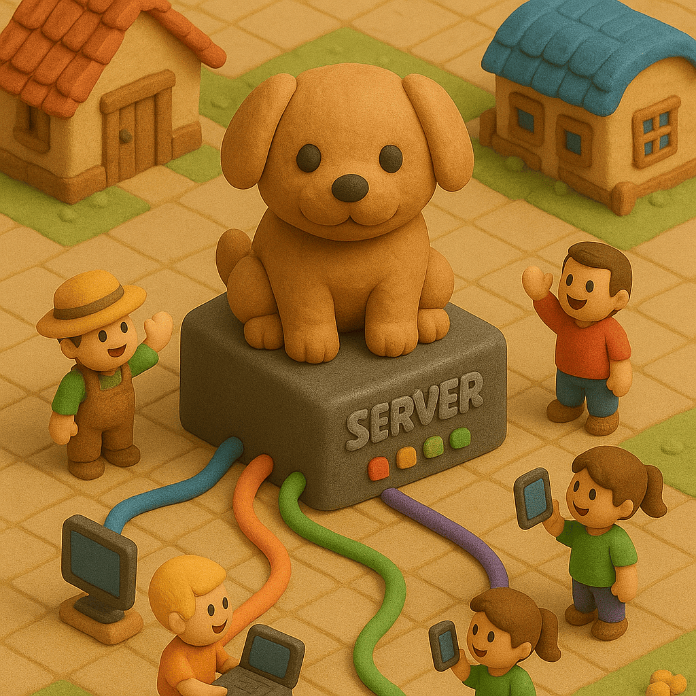
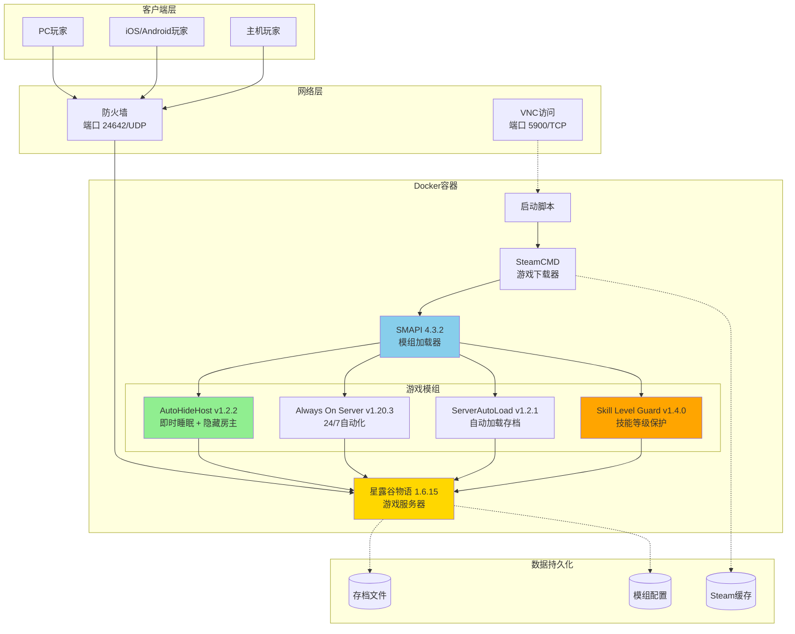

<div align="center">

<table>
<tr>
<td width="30%" align="center">
  
</td>
<td width="70%">

# Puppy Stardew Server
## 星露谷物语一键搭建开服联机

[](https://hub.docker.com/r/truemanlive/puppy-stardew-server)
[](https://hub.docker.com/r/truemanlive/puppy-stardew-server)
[](https://github.com/truman-world/puppy-stardew-server)
[](LICENSE)

[English](README.md) | 中文

**一键部署星露谷物语服务器 | 全平台联机支持**

</td>
</tr>
</table>

</div>

---

## 💡 推荐云服务器配置

运行本服务器推荐配置：**2核2G内存，3M带宽以上**

### 阿里云 - 120+款云产品专属折扣

**[点击领取 6.5 折优惠券](https://www.aliyun.com/minisite/goods?userCode=9l3an8ag)** ⚠️ 记得先领取优惠券再购买！

<a href="https://www.aliyun.com/minisite/goods?userCode=9l3an8ag" target="_blank">
  
</a>

- **[阿里云 2核2G 200M峰值带宽 38元/年](https://www.aliyun.com/minisite/goods?userCode=9l3an8ag)**

### 其他云服务商

- **[腾讯云 2核2G3M 68元/年](https://cloud.tencent.com/act/cps/redirect?redirect=6544&cps_key=88654ec92806114819c3fe1c909cd452&from=console)**
- **[京东云 2核2G 58元/年](https://3.cn/2iwmQ-AC)**

---

## 项目架构



## 3分钟搭建星露谷物语服务器

搭建**星露谷物语专用服务器**从未如此简单！通过**一条命令**，您就可以拥有自己的 24/7 多人联机服务器，支持**全平台**联机 - PC、Mac、Linux、iOS 和 Android 玩家都可以一起游戏。

**完美适用于：**
- **远程联机** - 与世界各地的朋友一起玩
- **跨平台游戏** - iOS、Android 和 PC 玩家一起联机
- **24/7 在线服务器** - 随时加入，无需房主在线
- **简单搭建** - 使用 Docker Compose 一键部署
- **低资源占用** - 仅需 2GB 内存即可流畅运行

## 核心功能

- **一键部署** - 一条命令 3 分钟完成部署
- **全平台支持** - PC、Mac、Linux、iOS、Android 全支持
- **24/7 专用服务器** ⚡ - 服务器独立运行，不需要房主在线
- **Docker Compose** - 轻松部署和管理
- **资源高效** - 2GB 内存服务器也能流畅运行
- **自动加载存档** - 重启容器，存档自动加载
- **VNC 远程访问** 🖥️ - 内置 VNC，首次设置超简单
- **即时睡眠** - 附加功能：玩家随时可以睡觉，无需等待
- **隐藏房主** - 房主玩家自动隐藏，零干扰
- **技能等级保护** 🛡️ - 新功能：防止等级异常，保持自然成长

<div align="center">


*附加功能：即时睡眠 - 点击床 → 立即睡眠 → 新的一天开始！*

</div>

## 最新版本更新

### v1.0.58 (2025年11月9日)

**Skill Level Guard v1.4.0 - 重大修复：**
- **✅ 已修复：** Always On Server 容器重启后自动启用功能正常工作
- **新增：** 通过反射调用ToggleAutoMode方法实现Auto Mode自动启用
- **验证：** 游戏在无玩家时正确暂停，ServerAutoLoad自动加载存档
- **保持：** 技能等级防护功能继续工作，基于经验值精确计算等级

**核心改进：**
- 完全自动化的Always On Server启用流程
- 无需手动按F9或VNC操作
- 容器重启后游戏自动暂停，等待玩家连接

## 快速开始

### 观看一键部署演示

[](https://asciinema.org/a/SYBS2qWsb5ZlSolbFPuoA7EJY)

### 方式 1：一键部署（推荐小白使用）

**中文版:**

```bash
curl -sSL https://raw.githubusercontent.com/truman-world/puppy-stardew-server/main/quick-start-zh.sh | bash
```

**⚠️ 国内网络访问提示:**

如果上面的命令访问失败（`raw.githubusercontent.com` 被屏蔽），请使用**方式 2：手动部署**（见下方），步骤同样简单，且**完全不需要访问 GitHub**。

脚本会自动：
- 检查 Docker 安装
- 引导输入 Steam 凭证
- 创建必要目录并设置正确权限
- 生成配置文件
- 启动服务器
- 显示连接信息

**就这么简单！** ☕ 下载游戏文件时去喝杯咖啡（约 1.5GB）。

<details>
<summary><h3>方式 2：手动部署（国内网络友好）</h3></summary>

#### 前置要求

- 已安装 Docker 和 Docker Compose
  - **快速安装**（Linux）：`curl -fsSL https://get.docker.com | sh`
  - **或参考官方指南**：[安装 Docker](https://docs.docker.com/get-docker/)
- 一个 Steam 账户，**并且已购买星露谷物语**
- 最低 2GB 内存，推荐 4GB
- 2GB 可用磁盘空间

#### 步骤 1：创建工作目录和配置文件（无需访问 GitHub）

```bash
# 创建工作目录
mkdir -p ~/puppy-stardew && cd ~/puppy-stardew

# 直接创建 docker-compose.yml（使用 Docker Hub 镜像）
cat > docker-compose.yml << 'EOF'
version: '3.8'
services:
  stardew-server:
    image: truemanlive/puppy-stardew-server:latest
    container_name: puppy-stardew
    restart: unless-stopped
    stdin_open: true
    tty: true
    environment:
      - STEAM_USERNAME=${STEAM_USERNAME}
      - STEAM_PASSWORD=${STEAM_PASSWORD}
      - ENABLE_VNC=${ENABLE_VNC:-true}
      - VNC_PASSWORD=${VNC_PASSWORD:-stardew123}
    ports:
      - "24642:24642/udp"
      - "5900:5900/tcp"
    volumes:
      - ./data/saves:/home/steam/.config/StardewValley:rw
      - ./data/game:/home/steam/stardewvalley:rw
      - ./data/steam:/home/steam/Steam:rw
    deploy:
      resources:
        limits:
          cpus: '2.0'
          memory: 2G
        reservations:
          memory: 1G
EOF

# 创建 .env 配置文件
cat > .env << 'EOF'
# Steam 账户信息（必填 - 请修改为您的真实账号）
STEAM_USERNAME=your_steam_username
STEAM_PASSWORD=your_steam_password

# VNC 配置（可选）
ENABLE_VNC=true
VNC_PASSWORD=stardew123
EOF
```

#### 步骤 2：编辑配置文件，填入您的 Steam 凭证

```bash
# 使用文本编辑器修改 .env 文件
nano .env  # 或使用 vi、vim 等编辑器
```

**重要**：您必须在 Steam 上拥有星露谷物语。游戏文件通过您的账户下载。

#### 步骤 3：初始化数据目录

```bash
# 创建数据目录并设置正确权限
mkdir -p data/{saves,game,steam}
chown -R 1000:1000 data/
```

**⚠️ 此步骤很重要！** 权限设置不正确会导致 "Disk write failure" 错误。从 v1.0.59+ 版本开始，容器会自动修复权限，但首次创建目录时仍需正确设置。

#### 步骤 4：启动服务器

```bash
# 启动服务器
docker compose up -d

# 查看日志
docker logs -f puppy-stardew
```

**如果启用了 Steam 令牌**，您需要输入验证码：

```bash
docker attach puppy-stardew
# 粘贴您的 Steam 令牌代码并按回车
# 重要：不会显示任何内容 - 这是正常的！
# 等待几秒钟，游戏会自动开始下载
# 按 Ctrl+P Ctrl+Q 分离（不是 Ctrl+C！）
```

</details>

## 初始设置（仅首次运行）

服务器启动后，您需要**一次性**创建或加载存档：

1. **连接到 VNC：**
   - 地址：`服务器IP:5900`
   - 密码：您在 `.env` 文件中设置的 `VNC_PASSWORD`
   - VNC 客户端：[RealVNC](https://www.realvnc.com/en/connect/download/viewer/)、[TightVNC](https://www.tightvnc.com/) 或任何 VNC 查看器

2. **在 VNC 窗口中：**
   - 创建新农场，或
   - 加载现有存档

3. **加载完成后：**
   - ServerAutoLoad 模组会记住您的存档
   - 以后重启会自动加载此存档
   - Always On Server 会自动启用 Auto Mode
   - 您可以断开 VNC 连接了

4. **玩家现在可以连接了！**
   - 打开星露谷物语
   - 点击"合作" → "加入局域网游戏"
   - 服务器会自动出现在列表中
   - 或手动输入服务器IP：`192.168.1.100`（示例）
   - **重要说明**：
     - 只需输入IP地址，**不需要加端口号**（不是`192.168.1.100:24642`）
     - 自动使用24642/UDP端口
     - 如需内网穿透或端口转发，必须转发**UDP协议**（不是TCP）

## 包含内容

### 预装模组

| 模组 | 版本 | 用途 | 主要功能 |
|-----|------|------|--------|
| **Always On Server** | v1.20.3 | 保持服务器 24/7 运行，不需要房主在线 | 无人值守服务器运行 |
| **AutoHideHost** | v1.2.2 | 自定义模组 - 隐藏房主玩家并启用即时睡眠 | 无缝昼夜过渡 |
| **ServerAutoLoad** | v1.2.1 | 自定义模组 - 启动时自动加载存档 | 无需手动VNC加载 |
| **✨ Skill Level Guard** | v1.4.0 | **新版** - 防止Always On Server强制升到10级并实现自动启用 | 基于经验值精确计算等级 + Auto Mode自动启用 |

**v1.0.58 新功能：**
- 🎉 **已修复**：Always On Server容器重启后自动启用
- ✅ **新增**：Skill Level Guard v1.4.0通过反射调用ToggleAutoMode
- ✅ **已验证**：游戏在无玩家时正确暂停
- ✅ **已测试**：ServerAutoLoad和Always On Server协同工作正常

所有模组都已预配置，开箱即用！

## 常用操作

<details>
<summary><b>查看服务器日志</b></summary>

```bash
# 实时日志
docker logs -f puppy-stardew

# 最后 100 行
docker logs --tail 100 puppy-stardew
```
</details>

<details>
<summary><b>重启服务器</b></summary>

```bash
docker compose restart
```
</details>

<details>
<summary><b>停止服务器</b></summary>

```bash
docker compose down
```
</details>

<details>
<summary><b>更新到最新版本</b></summary>

```bash
docker compose down
docker pull truemanlive/puppy-stardew-server:latest
docker compose up -d
```
</details>

<details>
<summary><b>备份存档</b></summary>

```bash
# 手动备份
tar -czf backup-$(date +%Y%m%d).tar.gz data/saves/

# 或使用备份脚本（运行 quick-start.sh 后可用）
./backup.sh
```
</details>

<details>
<summary><b>更换或上传新存档</b></summary>

您可以随时更换当前存档或上传新存档。

### 方法 1：从本机上传存档

1. **在本机找到存档位置**：
   - **Windows**: `%AppData%\StardewValley\Saves\你的农场_123456789\`
   - **Mac**: `~/.config/StardewValley/Saves/你的农场_123456789/`
   - **Linux**: `~/.config/StardewValley/Saves/你的农场_123456789/`

2. **上传到服务器**：
   ```bash
   # 将整个存档文件夹复制到服务器
   scp -r 你的农场_123456789/ root@服务器IP:/root/puppy-stardew-server/data/saves/Saves/
   ```

3. **重启容器**（会自动修复权限）：
   ```bash
   docker compose restart
   ```

4. **验证加载**：
   ```bash
   docker logs -f puppy-stardew
   # 查找："✓ SAVE LOADED SUCCESSFULLY"
   ```

### 方法 2：替换现有存档

1. **备份当前存档**（可选但推荐）：
   ```bash
   tar -czf old-save-$(date +%Y%m%d).tar.gz data/saves/
   ```

2. **删除旧存档**：
   ```bash
   rm -rf data/saves/Saves/旧农场_*
   ```

3. **上传新存档**（同方法 1 的步骤 2-4）

### 重要提示

- **权限自动修复**：容器启动时会自动修复文件权限（v1.0.59+）
- **无需手动 chown**：上传文件后只需重启容器即可
- **存档格式**：必须是多人存档（通过 CO-OP 菜单创建，而非"新游戏"）
- **ServerAutoLoad**：会自动检测并加载新存档

### 故障排除

如果存档没有加载：
```bash
# 检查存档文件是否存在
docker exec puppy-stardew ls -la /home/steam/.config/StardewValley/Saves/

# 检查权限（应该是 steam:steam 或 1000:1000）
docker exec puppy-stardew ls -l /home/steam/.config/StardewValley/Saves/你的农场_*/

# 强制重启以触发权限修复
docker compose restart
```
</details>

## 故障排除

<details>
<summary><b>错误："Disk write failure" 下载游戏时</b></summary>

**原因**：数据目录权限不正确。

**解决方法**（v1.0.59+）：
```bash
# 只需重启容器 - 会自动修复权限
docker compose restart
```

**手动修复**（如果自动修复不起作用）：
```bash
chown -R 1000:1000 data/
docker compose restart
```

**注意**：从 v1.0.59 开始，容器启动时会自动修复文件权限。上传文件后只需重启容器即可。
</details>

<details>
<summary><b>需要 Steam 令牌代码</b></summary>

如果您启用了 Steam 令牌：

```bash
docker attach puppy-stardew
# 粘贴您邮箱/手机应用中的代码并按回车
# 重要：不会显示任何输出 - 这是正常的！
# 等待几秒钟，游戏会自动开始下载
# 按 Ctrl+P Ctrl+Q 分离（不是 Ctrl+C！）
```

**提示**：建议使用 Steam 令牌手机应用，获取代码更快。
</details>

<details>
<summary><b>游戏无法启动</b></summary>

1. 检查日志：`docker logs puppy-stardew`
2. 验证 `.env` 中的 Steam 凭证
3. 确保您在 Steam 上拥有星露谷物语
4. 检查磁盘空间：`df -h`
5. 重启：`docker compose restart`
</details>

<details>
<summary><b>玩家无法连接</b></summary>

1. **检查防火墙**：端口 `24642/udp` 必须开放
   ```bash
   # Ubuntu/Debian
   sudo ufw allow 24642/udp

   # CentOS/RHEL
   sudo firewall-cmd --add-port=24642/udp --permanent
   sudo firewall-cmd --reload
   ```

2. **验证服务器正在运行**：
   ```bash
   docker ps | grep puppy-stardew
   ```

3. **检查存档是否已加载**：通过 VNC 连接或检查日志中的 "Save loaded"

4. **确保游戏版本匹配**：服务器和客户端必须是相同的星露谷物语版本
</details>

<details>
<summary><b>Always On Server 未自动启用</b></summary>

**v1.0.58 已修复此问题！**

如果更新后仍然出现：

1. **拉取最新镜像**：
   ```bash
   docker compose down
   docker pull truemanlive/puppy-stardew-server:latest
   docker compose up -d
   ```

2. **检查模组版本**：
   ```bash
   docker logs puppy-stardew | grep "Skill Level Guard"
   # 应该显示 v1.4.0
   ```

3. **查看启用日志**：
   ```bash
   docker logs puppy-stardew | grep "Auto mode on"
   # 应该显示 "Auto mode on!" 消息
   ```
</details>

## 高级配置

<details>
<summary><b>自定义模组设置</b></summary>

模组配置文件在容器内的 `/home/steam/stardewvalley/Mods/` 目录：

```bash
# 编辑 AutoHideHost 配置
docker exec puppy-stardew nano /home/steam/stardewvalley/Mods/AutoHideHost/config.json

# 编辑 Always On Server 配置
docker exec puppy-stardew nano /home/steam/stardewvalley/Mods/AlwaysOnServer/config.json

# 编辑 ServerAutoLoad 配置
docker exec puppy-stardew nano /home/steam/stardewvalley/Mods/ServerAutoLoad/config.json
```

编辑后重启服务器：
```bash
docker compose restart
```
</details>

<details>
<summary><b>更改端口号</b></summary>

编辑 `docker-compose.yml`：

```yaml
ports:
  - "24642:24642/udp"  # 更改第一个数字为您想要的端口
  - "5900:5900/tcp"    # VNC 端口
```

更改后重启：
```bash
docker compose up -d
```
</details>

<details>
<summary><b>设置完成后禁用 VNC</b></summary>

编辑 `.env`：
```env
ENABLE_VNC=false
```

重启：
```bash
docker compose up -d
```

这可以节省约 50MB 内存。
</details>

## 系统要求

**服务器：**
- **CPU**：1+ 核心（4+ 玩家推荐 2+）
- **内存**：最低 2GB（4+ 玩家推荐 4GB）
- **磁盘**：2GB 可用空间
- **操作系统**：Linux、Windows（Docker Desktop）、macOS（Docker Desktop）
- **网络**：开放端口 24642/UDP（VNC 需要 5900/TCP）

**客户端：**
- 星露谷物语（任何平台：PC、Mac、Linux、iOS、Android）
- 与服务器相同的游戏版本（1.6.15）
- 局域网或互联网连接到服务器

## 许可证与法律

**许可证**：MIT 许可证 - 免费使用、修改和分发。

**重要法律说明：**
- 您必须在 Steam 上拥有星露谷物语
- 游戏文件通过您的 Steam 账户下载
- 这不是盗版工具
- 模组遵循其原始许可证：
  - Always On Server：[GPL-3.0](https://github.com/funny-snek/Always-On-Server-for-Multiplayer)
  - ServerAutoLoad：MIT（本项目自定义模组）
  - AutoHideHost：MIT（本项目自定义模组）
  - Skill Level Guard：MIT（本项目自定义模组）

## 致谢

- **星露谷物语** by [ConcernedApe](https://www.stardewvalley.net/)
- **SMAPI** by [Pathoschild](https://smapi.io/)
- **Always On Server** by funny-snek & Zuberii
- **Docker** by Docker, Inc.

## 贡献

欢迎贡献！请：

1. Fork 本仓库
2. 创建功能分支
3. 提交 Pull Request

## 支持与社区

- **错误报告**：[GitHub Issues](https://github.com/truman-world/puppy-stardew-server/issues)
- **问题讨论**：[GitHub Discussions](https://github.com/truman-world/puppy-stardew-server/discussions)
- **Docker Hub**：[truemanlive/puppy-stardew-server](https://hub.docker.com/r/truemanlive/puppy-stardew-server)

## Star 历史

如果这个项目帮助了您，请考虑给个 Star！⭐

---

<div align="center">

**为星露谷物语社区用爱制作**

Made with ❤️ for the Stardew Valley Community

</div>
